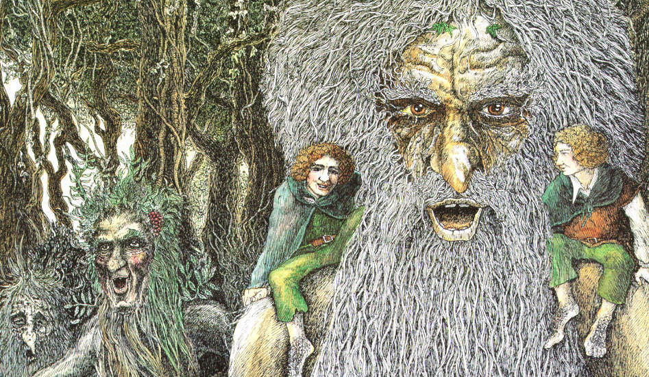

# Ents



## Understanding Scala 3 Compiler Trees

Ents is a small project to help me learn the Scala 3 compiler trees. There is a
great [video lecture](https://youtu.be/yYd-zuDd3S8) by [Dmitry
Petrashko](https://twitter.com/darkdimius) that I learned a ton from, but I suck
at just listening and retaining. So this project was a way for me to take some
notes and demonstrate with code the Trees that are being covered.

As I learn more about Trees I'll continue to add and amend these to hopefully
give a thorough overview and help someone else understand Trees. This is heavily
a work in progress at the moment.

## How to run

Ents is a command-line application built with
[scala-cli](https://scala-cli.virtuslab.org/). To use it, just run `scala-cli
run .` and follow the instructions by choosing the type of tree you'd like to
see. You'll then get a brief description, a code sample, and a tree that most
closely encloses the `<<>>` markers.

```
❯ scala-cli run .
Choose the type of tree you'd like to see:
[0] Apply
[1] Assign
[2] Block
[3] CaseDef
[4] DefDef
[5] Ident
[6] If
[7] Import
[8] Match
[9] NamedArg
[10] New
[11] Literal
[12] PackageDef
[13] Return
[14] Select
[15] SeqLiteral
[16] Super
[17] Template
[18] This
[19] Try
[20] TypeDef
[21] Typed
[22] TypeApply
[23] ValDef
> 8
Description:
A Match tree represents the entire match expression including all
of the cases.

The selector is what you are matching on and the cases are the
actual cases you are matching on.

Code example:
def foo(a: Int) = <<a match
  case 1 => "you got a one!"
  case _ => "you didn't get a one!">>

Minimal Tree:
Match(Ident(a),List(CaseDef(Literal(Constant(1)),EmptyTree,Block(List(),Literal(Constant(you got a one!)))), CaseDef(Ident(_),EmptyTree,Block(List(),Literal(Constant(you didn't get a one!))))))

Verbose Tree:
Match(
  selector = Ident(name = a),
  cases = List(
    CaseDef(
      pat = Literal(const = ( = 1)),
      guard = Thicket(trees = List()),
      body = Block(stats = List(), expr = Literal(const = ( = "you got a one!")))
    ),
    CaseDef(
      pat = Ident(name = _),
      guard = Thicket(trees = List()),
      body = Block(stats = List(), expr = Literal(const = ( = "you didn't get a one!")))
    )
  )
)
```

<sub>_The image is "Treebeard and the Ents" by Timothy Ide_</sub>
